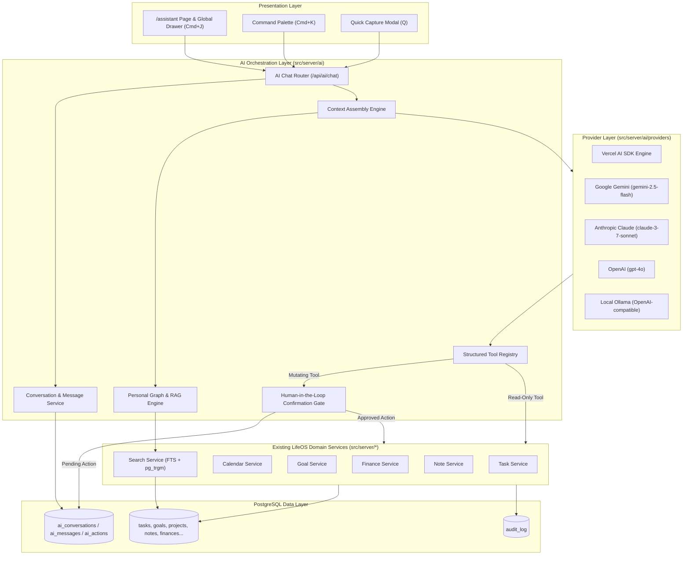
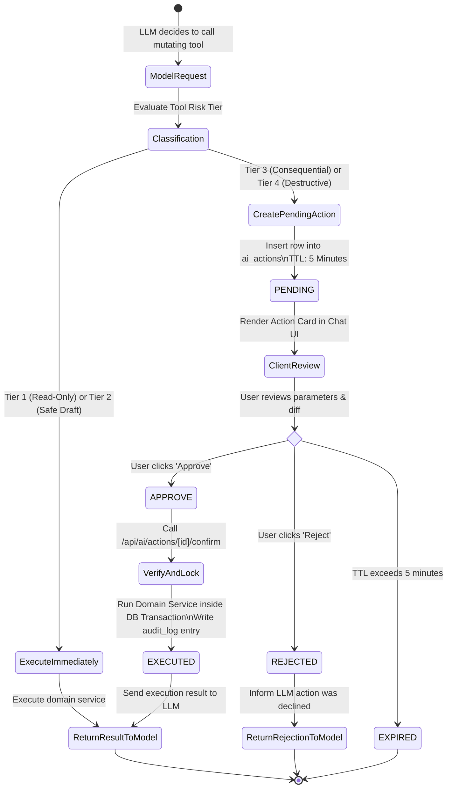

# Phase 6 — AI Layer & Assistant: Architectural Specification

**Phase:** Phase 6: AI Layer & Assistant  
**Status:** Approved Architecture  
**Target Milestone:** v1 Release  
**Last Updated:** 2026-09-23  

---

## 1. Architectural Principles

1. **Untrusted Caller Model:** The LLM is an untrusted entity that suggests intents and arguments. It is never an authorization authority.
2. **Domain Service Inviolability:** The AI layer never executes raw SQL and never directly manipulates database records. All reads and mutations pass through canonical domain services (`TaskService`, `ProjectService`, `GoalService`, `FinanceService`, etc.).
3. **Strict Resource Ownership:** All AI requests, tools, and retrievals inherit the authenticated session's `user_id`. Multi-tenant boundaries are strictly enforced at the query level via `withUserScope` and `requireResourceOwnership`.
4. **Mandatory Human-in-the-Loop for Mutations:** Consequential and destructive mutations cannot be committed by the model alone. They must be intercepted, transformed into a previewable pending action, and explicitly confirmed by the user.
5. **Provider Agnosticism:** Core application logic and tools are decoupled from LLM vendors via the Vercel AI SDK abstraction, supporting Google Gemini, Anthropic Claude, OpenAI, and local Ollama.
6. **Relational-First Personal Graph:** Context retrieval utilizes PostgreSQL's native `tsvector` + `pg_trgm` hybrid search and relational foreign key traversal, preserving the vertical-slice database rule without premature vector infrastructure.

---

## 2. Component Boundaries & Data Flow



---

## 3. Provider Abstraction Contract

### 3.1 Interface Definition (`src/server/ai/types.ts`)
```ts
export type AIProviderName = "google" | "anthropic" | "openai" | "ollama";

export interface AIModelConfig {
  provider: AIProviderName;
  model: string;
  temperature?: number;
  maxTokens?: number;
  apiKey?: string; // Optional user-override key (decrypted in memory only)
  baseURL?: string; // For Ollama or custom gateways
}

export interface ProviderTokenUsage {
  promptTokens: number;
  completionTokens: number;
  totalTokens: number;
  estimatedCostUsd: number;
}
```

### 3.2 Factory & Fallback Mechanism
```ts
export function resolveLanguageModel(config: AIModelConfig, userEncryptedKeys?: UserAIKeys) {
  // 1. Resolve API key: User Encrypted Key -> Server Env -> Throw ConfigurationError
  // 2. Instantiate provider via Vercel AI SDK (@ai-sdk/google, @ai-sdk/anthropic, etc.)
  // 3. Apply timeout and retry defaults
}
```

---

## 4. Personal Graph & Context Assembly Pipeline

### 4.1 Intent & Domain Routing
When the user sends a message, the Context Assembly Engine performs lightweight intent routing:
- **Temporal Keywords** ("today", "schedule", "plan", "overdue") → Ingest active daily plan + overdue tasks + today's calendar blocks.
- **Entity Keywords** ("goal", "project", "budget", "finance") → Query relevant domain summary services.
- **Freeform Knowledge Queries** → Trigger hybrid search across notes and content.

### 4.2 Relational Expansion (1-2 Hop Traversal)
Search results are expanded through foreign key relationships:
```
[Matched Note] ──(via learning_id)──> [Linked Learning Item]
[Matched Task] ──(via project_id)───> [Project Name & Status]
              ──(via goal_id)──────> [Goal Title & Target Date]
[Matched Goal] ──(via reverse FK)───> [Active Projects & Milestones]
```

### 4.3 Sanitized Context Formatting
Retrieved data is wrapped in strict structural tags with pass-through defense against indirect prompt injection:
```xml
<context>
  <temporal_anchor date="2026-09-23" day_of_week="Wednesday" timezone="UTC" />
  <user_state working_hours="09:00-18:00">
    <daily_plan status="in_progress" focus_items="3" />
    <overdue_tasks count="2">
      <task id="task-1" title="Review Quarterly Taxes" priority="high" due="2026-09-20" />
    </overdue_tasks>
  </user_state>
  <retrieved_entities count="2">
    <entity domain="notes" id="note-123" title="Q3 Marketing Strategy" untrusted_data="true">
      ...content snippet...
    </entity>
  </retrieved_entities>
</context>
```

---

## 5. Tool Registry & Execution Architecture

### 5.1 Tool Definition Contract
```ts
export type RiskTier = "tier1_readonly" | "tier2_low" | "tier3_consequential" | "tier4_destructive";

export interface LifeOSTool<TInput extends z.ZodTypeAny, TOutput> {
  id: string;
  name: string;
  description: string;
  category: "tasks" | "calendar" | "goals" | "projects" | "notes" | "finance" | "content" | "people";
  riskTier: RiskTier;
  schema: TInput;
  execute: (ctx: ToolContext, args: z.infer<TInput>) => Promise<TOutput>;
  previewAction?: (args: z.infer<TInput>) => ActionPreview;
}
```

### 5.2 Server-Side Execution Context (`ToolContext`)
```ts
export interface ToolContext {
  userId: string;
  conversationId: string;
  messageId: string;
  source: "web_chat" | "command_palette" | "quick_capture" | "automation";
}
```
Every tool execution receives `ctx.userId` directly from the authenticated session. The tool cannot accept or override `userId` from model-generated arguments.

---

## 6. Human-in-the-Loop Confirmation State Machine



### 6.1 Cryptographic & Single-Use Protections
1. **Database Row Lock:** Confirmation queries execute `SELECT * FROM ai_actions WHERE id = ? FOR UPDATE`.
2. **Single-Use Guard:** The action status must be `'pending'`. Once set to `'executed'` or `'rejected'`, any subsequent confirmation attempt immediately fails closed with `409 Conflict`.
3. **Expiration:** Actions older than 5 minutes fail closed with `410 Gone`.

---

## 7. Database Migration: `0021_ai_layer_and_assistant.sql`

```sql
-- AI Conversations Table
CREATE TABLE IF NOT EXISTS "ai_conversations" (
  "id" text PRIMARY KEY DEFAULT gen_random_uuid(),
  "user_id" text NOT NULL REFERENCES "user"("id") ON DELETE CASCADE,
  "title" text NOT NULL DEFAULT 'New Conversation',
  "provider" text NOT NULL DEFAULT 'google',
  "model" text NOT NULL DEFAULT 'gemini-2.5-flash',
  "system_prompt_override" text,
  "metadata" jsonb DEFAULT '{}'::jsonb,
  "created_at" timestamp with time zone DEFAULT now() NOT NULL,
  "updated_at" timestamp with time zone DEFAULT now() NOT NULL
);

CREATE INDEX IF NOT EXISTS "ai_conversations_user_id_created_at_idx" ON "ai_conversations"("user_id", "created_at" DESC);

-- AI Messages Table
CREATE TABLE IF NOT EXISTS "ai_messages" (
  "id" text PRIMARY KEY DEFAULT gen_random_uuid(),
  "conversation_id" text NOT NULL REFERENCES "ai_conversations"("id") ON DELETE CASCADE,
  "user_id" text NOT NULL REFERENCES "user"("id") ON DELETE CASCADE,
  "role" text NOT NULL CHECK ("role" IN ('system', 'user', 'assistant', 'tool')),
  "content" text NOT NULL DEFAULT '',
  "tool_calls" jsonb,
  "tool_results" jsonb,
  "token_count" integer,
  "metadata" jsonb DEFAULT '{}'::jsonb,
  "created_at" timestamp with time zone DEFAULT now() NOT NULL
);

CREATE INDEX IF NOT EXISTS "ai_messages_conversation_id_created_at_idx" ON "ai_messages"("conversation_id", "created_at" ASC);
CREATE INDEX IF NOT EXISTS "ai_messages_user_id_idx" ON "ai_messages"("user_id");

-- AI Pending & Executed Actions (Human-in-the-Loop)
CREATE TABLE IF NOT EXISTS "ai_actions" (
  "id" text PRIMARY KEY DEFAULT gen_random_uuid(),
  "conversation_id" text NOT NULL REFERENCES "ai_conversations"("id") ON DELETE CASCADE,
  "message_id" text REFERENCES "ai_messages"("id") ON DELETE SET NULL,
  "user_id" text NOT NULL REFERENCES "user"("id") ON DELETE CASCADE,
  "tool_name" text NOT NULL,
  "risk_level" text NOT NULL CHECK ("risk_level" IN ('low', 'consequential', 'destructive')),
  "status" text NOT NULL DEFAULT 'pending' CHECK ("status" IN ('pending', 'approved', 'rejected', 'executed', 'failed', 'expired')),
  "parameters" jsonb NOT NULL,
  "preview_data" jsonb NOT NULL,
  "expires_at" timestamp with time zone NOT NULL,
  "executed_at" timestamp with time zone,
  "audit_log_id" text REFERENCES "audit_log"("id") ON DELETE SET NULL,
  "error_message" text,
  "created_at" timestamp with time zone DEFAULT now() NOT NULL
);

CREATE INDEX IF NOT EXISTS "ai_actions_user_status_expires_idx" ON "ai_actions"("user_id", "status", "expires_at");
CREATE INDEX IF NOT EXISTS "ai_actions_conversation_id_idx" ON "ai_actions"("conversation_id");
```

---

## 8. Observability, Cost & Rate Limiting

1. **Per-Message Token Accounting:** Every completed model generation persists `promptTokens`, `completionTokens`, and `estimatedCostUsd` inside `ai_messages.metadata`.
2. **Audit Logging Integration:** All confirmed tool executions invoke `createAuditLog` with:
   - `category: "mutation"`
   - `action: "ai.tool_executed"`
   - `actor: "user:${userId}"`
   - `details: { toolName, parameters, actionId }`
3. **Sanitized Logs:** Prompts, responses, and tool arguments are scrubbed of credentials before logging. API keys and passwords are NEVER included in AI context or audit logs.
4. **Rate Limiting:** Protect `/api/ai/chat` with an in-memory/sliding-window rate limiter (e.g. 20 requests per minute per user) to safeguard against accidental infinite UI loops or abuse.
