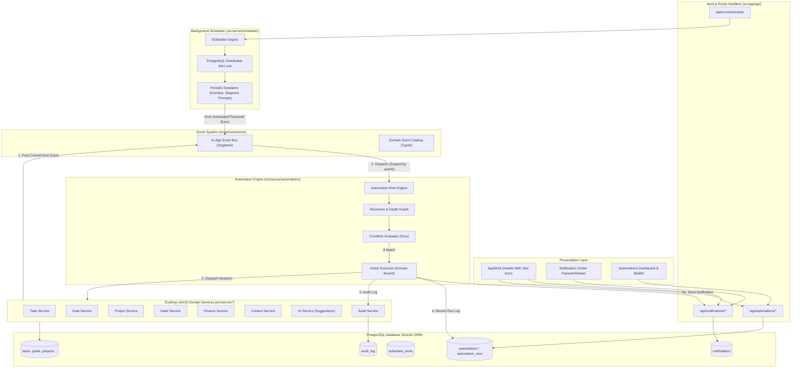

# Phase 7 — Automations & Event Engine: Architectural Specification

**Phase:** Phase 7: Automations & Event Engine  
**Status:** Approved Architecture  
**Target Milestone:** v1 Release  
**Last Updated:** 2026-09-23  

---

## 1. Architectural Principles

1. **Decoupled Reactive Nervous System:** Domain services manage their primary entities and emit strongly typed domain events without knowing about downstream consumers (automations, notifications, future external webhooks).
2. **Domain Service Inviolability:** Automation actions never execute raw SQL or mutate database records directly. All actions strictly dispatch through existing domain services (`TaskService`, `ProjectService`, `GoalService`, `NotificationService`, `AuditService`).
3. **Single-Tenant Security with Multi-Tenant Schema Invariants:** Every event, rule, notification, and scheduler job is strictly isolated to the authenticated user's `userId`. No action can execute against or view another user's resources.
4. **Execution Isolation & Error Containment:** A failure in an event subscriber, condition evaluation, or automation action must never crash the primary domain operation or roll back the caller's transaction. All handler dispatches run with isolated error boundaries.
5. **Recursion & Cascade Defense:** Execution contexts carry strict depth tracking (`depth: number`). Automated mutations exceeding `MAX_AUTOMATION_DEPTH = 3` are forcefully aborted to prevent infinite execution loops.
6. **Zero External Infrastructure Dependency:** All scheduling, event dispatching, and notification processing operates within the existing Next.js and PostgreSQL environment, avoiding premature introduction of Redis, Kafka, or heavy external message queues.
7. **Vertical-Slice Database Scope:** Database migration `0022_automations_and_event_engine.sql` introduces strictly the tables required for Phase 7: `notifications`, `automations`, `automation_runs`, and `scheduler_locks`.

---

## 2. Component Architecture & Data Flow



---

## 3. Domain Event Catalog

All events inherit `BaseDomainEvent`:

```typescript
export interface BaseDomainEvent<TName extends string, TPayload> {
  id: string; // UUID
  name: TName;
  userId: string;
  timestamp: string; // ISO 8601
  payload: TPayload;
  metadata?: {
    correlationId?: string;
    depth?: number;
    actor?: string;
  };
}
```

### Event Roster:

| Domain | Event Name | Payload Summary |
| :--- | :--- | :--- |
| **Tasks** | `task.created` | `{ task: TaskDTO }` |
| | `task.updated` | `{ task: TaskDTO, updatedFields: string[], previousStatus?: TaskStatus }` |
| | `task.completed` | `{ task: TaskDTO, completedAt: string }` |
| | `task.deleted` | `{ taskId: string, projectId?: string, goalId?: string }` |
| | `task.overdue` | `{ task: TaskDTO, daysOverdue: number }` |
| **Projects** | `project.created` | `{ project: ProjectDTO }` |
| | `project.updated` | `{ project: ProjectDTO, updatedFields: string[] }` |
| | `project.completed` | `{ project: ProjectDTO, completedAt: string }` |
| | `project.all_tasks_completed` | `{ project: ProjectDTO }` |
| **Goals** | `goal.created` | `{ goal: GoalDTO }` |
| | `goal.progress_updated` | `{ goal: GoalDTO, previousProgress: number, currentProgress: number }` |
| | `goal.completed` | `{ goal: GoalDTO, completedAt: string }` |
| | `goal.stagnant` | `{ goal: GoalDTO, daysWithoutProgress: number }` |
| **Habits** | `habit.logged` | `{ habit: HabitDTO, entry: HabitEntryDTO, streak: number }` |
| | `habit.streak_milestone` | `{ habit: HabitDTO, streak: number }` |
| **Finance** | `finance.transaction_created` | `{ transaction: TransactionDTO }` |
| | `finance.budget_exceeded` | `{ categoryId: string, budgetAmount: number, spentAmount: number }` |
| **Content** | `content.status_changed` | `{ content: ContentItemDTO, previousStatus: string, newStatus: string }` |
| | `content.published` | `{ content: ContentItemDTO, publishedAt: string }` |
| **AI** | `ai.action_confirmed` | `{ actionId: string, toolName: string, parameters: Record<string, unknown> }` |
| | `ai.action_rejected` | `{ actionId: string, toolName: string, reason?: string }` |
| **System** | `system.morning_routine_due` | `{ userId: string, date: string, targetHour: string }` |
| | `system.evening_review_due` | `{ userId: string, date: string, targetHour: string }` |

---

## 4. Trigger-Condition-Action Rule Engine Specification

### 4.1 Condition Structure
Conditions are defined as an array of clauses:
```typescript
export interface ConditionClause {
  field: string; // e.g. "task.priority", "habit.streak", "project.allTasksCompleted"
  operator: 
    | "equals" 
    | "not_equals" 
    | "greater_than" 
    | "greater_than_or_equal" 
    | "less_than" 
    | "less_than_or_equal" 
    | "contains" 
    | "not_contains" 
    | "in" 
    | "not_in" 
    | "is_empty" 
    | "is_not_empty";
  value: unknown;
}

export interface ConditionGroup {
  combinator: "AND" | "OR";
  clauses: ConditionClause[];
}
```

### 4.2 Action Types & Configuration:
1. `create_notification`:
   ```typescript
   {
     title: string;
     message: string;
     type: "info" | "warning" | "success" | "error" | "reminder";
     linkUrl?: string;
   }
   ```
2. `create_task`:
   ```typescript
   {
     title: string;
     priority: "low" | "medium" | "high" | "critical";
     dueOffsetDays?: number;
     tags?: string[];
     projectId?: string;
   }
   ```
3. `update_project`:
   ```typescript
   {
     projectId?: string; // or extracted from event context
     status: "planning" | "active" | "paused" | "completed" | "archived";
   }
   ```
4. `trigger_ai_suggestions`:
   ```typescript
   {
     type: "daily_planning" | "weekly_review";
   }
   ```
5. `log_audit`:
   ```typescript
   {
     category: "system";
     action: string;
     details?: Record<string, unknown>;
   }
   ```

---

## 5. Background Scheduler & Distributed Idempotency

### 5.1 Idempotency Key Architecture
To prevent duplicate job execution (e.g. running 8 AM morning review twice if two cron calls occur), the system uses `scheduler_locks`:

```sql
CREATE TABLE scheduler_locks (
    id TEXT PRIMARY KEY,
    user_id TEXT NOT NULL REFERENCES users(id) ON DELETE CASCADE,
    job_name TEXT NOT NULL,
    idempotency_key TEXT NOT NULL, -- e.g. "morning_prompt:user123:2026-09-23"
    status TEXT NOT NULL CHECK (status IN ('locked', 'completed', 'failed')),
    locked_at TIMESTAMP WITH TIME ZONE DEFAULT NOW() NOT NULL,
    completed_at TIMESTAMP WITH TIME ZONE,
    CONSTRAINT scheduler_locks_key_unique UNIQUE (user_id, idempotency_key)
);
```

When a scheduled job fires:
1. Attempt `INSERT INTO scheduler_locks (id, user_id, job_name, idempotency_key, status) VALUES (...) ON CONFLICT DO NOTHING`.
2. If insert returns 0 rows, another execution already claimed this job window; safely skip.
3. Execute job.
4. Update `status = 'completed', completed_at = NOW()`.

---

## 6. Database Schema Specification (Migration `0022`)

```sql
-- 1. Notifications Table
CREATE TABLE notifications (
    id TEXT PRIMARY KEY,
    user_id TEXT NOT NULL REFERENCES users(id) ON DELETE CASCADE,
    title VARCHAR(255) NOT NULL,
    message TEXT NOT NULL,
    type TEXT NOT NULL DEFAULT 'info' CHECK (type IN ('info', 'warning', 'success', 'error', 'reminder')),
    entity_type TEXT CHECK (entity_type IN ('task', 'project', 'goal', 'habit', 'finance', 'content', 'system')),
    entity_id TEXT,
    link_url TEXT,
    is_read BOOLEAN NOT NULL DEFAULT FALSE,
    read_at TIMESTAMP WITH TIME ZONE,
    metadata JSONB DEFAULT '{}'::jsonb,
    created_at TIMESTAMP WITH TIME ZONE DEFAULT NOW() NOT NULL
);

CREATE INDEX notifications_user_read_created_idx ON notifications(user_id, is_read, created_at DESC);
CREATE INDEX notifications_user_created_idx ON notifications(user_id, created_at DESC);

-- 2. Automations Table
CREATE TABLE automations (
    id TEXT PRIMARY KEY,
    user_id TEXT NOT NULL REFERENCES users(id) ON DELETE CASCADE,
    name VARCHAR(255) NOT NULL,
    description TEXT,
    trigger_type TEXT NOT NULL CHECK (trigger_type IN ('event', 'schedule', 'threshold')),
    trigger_config JSONB NOT NULL DEFAULT '{}'::jsonb,
    conditions JSONB NOT NULL DEFAULT '[]'::jsonb,
    action_type TEXT NOT NULL CHECK (action_type IN ('create_notification', 'create_task', 'update_task', 'update_project', 'log_audit', 'trigger_ai_suggestions')),
    action_config JSONB NOT NULL DEFAULT '{}'::jsonb,
    is_active BOOLEAN NOT NULL DEFAULT TRUE,
    execution_count INTEGER NOT NULL DEFAULT 0,
    last_run_at TIMESTAMP WITH TIME ZONE,
    created_at TIMESTAMP WITH TIME ZONE DEFAULT NOW() NOT NULL,
    updated_at TIMESTAMP WITH TIME ZONE DEFAULT NOW() NOT NULL
);

CREATE INDEX automations_user_active_idx ON automations(user_id, is_active);
CREATE INDEX automations_user_trigger_idx ON automations(user_id, trigger_type);

-- 3. Automation Runs Table
CREATE TABLE automation_runs (
    id TEXT PRIMARY KEY,
    user_id TEXT NOT NULL REFERENCES users(id) ON DELETE CASCADE,
    automation_id TEXT NOT NULL REFERENCES automations(id) ON DELETE CASCADE,
    trigger_event TEXT NOT NULL,
    status TEXT NOT NULL CHECK (status IN ('success', 'failed', 'skipped')),
    execution_duration_ms INTEGER NOT NULL DEFAULT 0,
    context_snapshot JSONB DEFAULT '{}'::jsonb,
    action_output JSONB DEFAULT '{}'::jsonb,
    error_message TEXT,
    created_at TIMESTAMP WITH TIME ZONE DEFAULT NOW() NOT NULL
);

CREATE INDEX automation_runs_user_auto_created_idx ON automation_runs(user_id, automation_id, created_at DESC);
CREATE INDEX automation_runs_user_status_idx ON automation_runs(user_id, status);

-- 4. Scheduler Locks Table
CREATE TABLE scheduler_locks (
    id TEXT PRIMARY KEY,
    user_id TEXT NOT NULL REFERENCES users(id) ON DELETE CASCADE,
    job_name VARCHAR(128) NOT NULL,
    idempotency_key VARCHAR(255) NOT NULL,
    status TEXT NOT NULL DEFAULT 'locked' CHECK (status IN ('locked', 'completed', 'failed')),
    locked_at TIMESTAMP WITH TIME ZONE DEFAULT NOW() NOT NULL,
    completed_at TIMESTAMP WITH TIME ZONE,
    CONSTRAINT scheduler_locks_key_unique UNIQUE (user_id, idempotency_key)
);

CREATE INDEX scheduler_locks_user_job_idx ON scheduler_locks(user_id, job_name);
```

---

## 7. Security & Concurrency Invariants

| Invariant | Implementation Mechanism |
| :--- | :--- |
| **Ownership Enforcement** | All queries and mutations include `eq(table.userId, authenticatedUserId)`. |
| **No Cross-User Notification Dispatch** | Notifications can only be sent to the authenticated user's account. |
| **Max Depth Loop Blocker** | `depth >= 3` triggers `RecursionLimitError` and writes to `audit_log`. |
| **Cron Secret Validation** | Timing-safe check `crypto.timingSafeEqual` between request bearer token and `CRON_SECRET`. |
| **Transactional Auditability** | Sensitive rule executions and failure alerts write immutable entries to `audit_log`. |
| **Zero Raw SQL in Actions** | Action handlers strictly call domain services (`createTask`, `updateTask`, etc.). |
