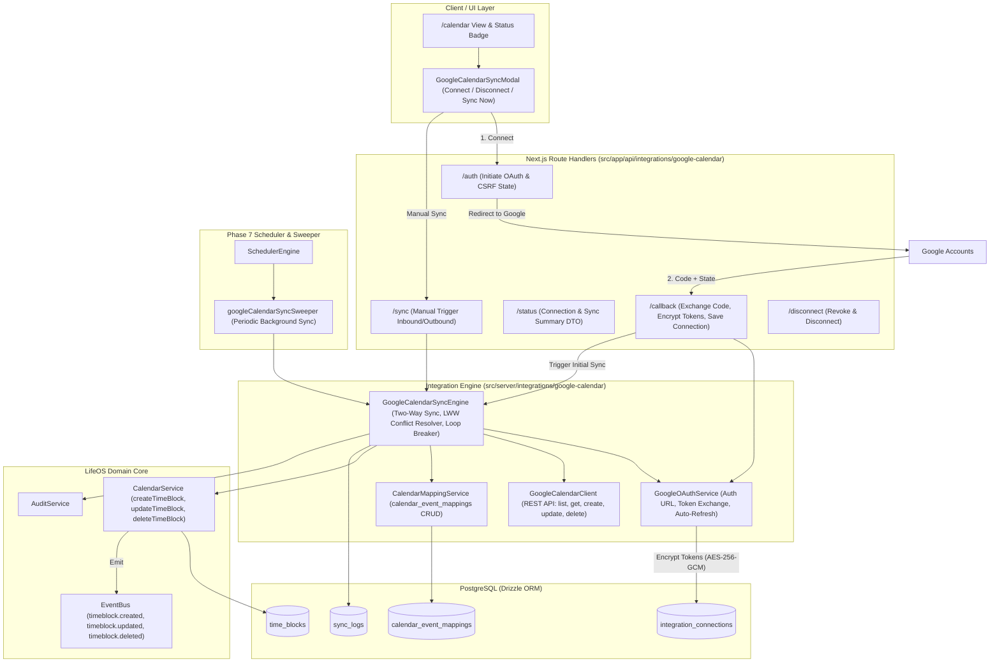

# Phase 8: External Integrations — Architectural Specification

**Phase:** Phase 8: External Integrations  
**Status:** Approved Architecture  
**Target Milestone:** v1 Release  
**Last Updated:** 2026-09-30  

---

## 1. Architectural Principles

1. **Adapter-Based Abstraction:** Integrations are implemented as standalone adapters behind clean interface contracts (`CalendarSyncAdapter`, `ActivityFeedAdapter`, `BackupAdapter`). The core application never directly couples to third-party SDKs or specific vendor APIs.
2. **Encrypted Credentials at Rest:** All sensitive OAuth access tokens, refresh tokens, and client secrets are encrypted using AES-256-GCM (`v1:iv:tag:ciphertext`) via `src/lib/crypto.ts` before insertion into PostgreSQL. Plaintext secrets never appear in logs or client-facing responses.
3. **Decoupled Two-Way Synchronization:** Synchronization consists of an inbound pass (Google Calendar -> LifeOS) followed by an outbound pass (LifeOS -> Google Calendar), coordinated with bidirectional mappings (`calendar_event_mappings`), Google `syncToken`, and explicit echo prevention.
4. **Idempotent Background Sweepers:** Periodic background synchronization is handled by a registered `PeriodicSweeper` within the Phase 7 `SchedulerEngine`, protected by PostgreSQL distributed locks (`scheduler_locks`).
5. **Vertical-Slice Database Scope:** Database migration `0023_external_integrations.sql` introduces strictly the tables required for Phase 8:
   - `integration_connections`: Multi-provider OAuth connection records and tokens.
   - `calendar_event_mappings`: Bidirectional link between `time_blocks` and external calendar events.
   - `sync_logs`: Historical audit trail of sync runs and statistics.

---

## 2. Component Architecture & Data Flow

---

## 3. Database Schema Specification

### 3.1 `integration_connections`
Stores third-party provider connections and OAuth credentials encrypted at rest.
- `id`: `text` (UUID, primary key)
- `userId`: `text` (references `user.id` ON DELETE CASCADE)
- `provider`: `text` ("google_calendar", "github", "backup")
- `status`: `text` ("connected", "disconnected", "error", "expired")
- `encryptedAccessToken`: `text` (nullable, AES-256-GCM)
- `encryptedRefreshToken`: `text` (nullable, AES-256-GCM)
- `tokenExpiresAt`: `timestamp with time zone` (nullable)
- `scope`: `text` (nullable)
- `externalAccountId`: `text` (nullable, e.g. user email)
- `metadata`: `jsonb` (e.g. `{ syncToken: string, calendarId: "primary", lastSyncAt: string }`)
- `createdAt`: `timestamp with time zone`
- `updatedAt`: `timestamp with time zone`
- Invariants: `unique(userId, provider)`, `foreignKey(userId -> user.id)`.

### 3.2 `calendar_event_mappings`
Maintains 1-to-1 bidirectional correspondence between LifeOS `time_blocks` and external provider events.
- `id`: `text` (UUID, primary key)
- `userId`: `text` (references `user.id` ON DELETE CASCADE)
- `connectionId`: `text` (references `integration_connections.id` ON DELETE CASCADE)
- `timeBlockId`: `text` (references `time_blocks.id` ON DELETE CASCADE)
- `externalCalendarId`: `text` (default "primary")
- `externalEventId`: `text` (Google Event ID)
- `externalEtag`: `text` (nullable)
- `syncDirection`: `text` ("inbound", "outbound", "bidirectional")
- `lastSyncedAt`: `timestamp with time zone`
- `createdAt`: `timestamp with time zone`
- `updatedAt`: `timestamp with time zone`
- Invariants: `unique(userId, timeBlockId)`, `unique(userId, externalEventId)`.

### 3.3 `sync_logs`
Audit record of every synchronization execution.
- `id`: `text` (UUID, primary key)
- `userId`: `text` (references `user.id` ON DELETE CASCADE)
- `connectionId`: `text` (references `integration_connections.id` ON DELETE CASCADE)
- `provider`: `text` ("google_calendar")
- `syncType`: `text` ("initial", "incremental", "outbound", "inbound", "manual")
- `status`: `text` ("success", "partial", "failed")
- `itemsProcessed`: `integer` (default 0)
- `itemsCreated`: `integer` (default 0)
- `itemsUpdated`: `integer` (default 0)
- `itemsDeleted`: `integer` (default 0)
- `itemsFailed`: `integer` (default 0)
- `errorMessage`: `text` (nullable)
- `startedAt`: `timestamp with time zone`
- `completedAt`: `timestamp with time zone`
- `createdAt`: `timestamp with time zone`

---

## 4. Conflict Resolution & Sync Algorithm

### Inbound Sync (Google -> LifeOS)
1. Retrieve connection; refresh access token if expired.
2. Call `GoogleCalendarClient.listEvents`:
   - If `syncToken` exists, query with `syncToken`.
   - If Google returns HTTP 410 Gone, wipe `syncToken` and re-query with bounded time range (`now - 30d` to `now + 90d`).
3. For each event in `items`:
   - If `status === "cancelled"`:
     - Find mapping by `(userId, externalEventId)`.
     - If mapped block exists, update status to `cancelled` (or soft delete) via `CalendarService`.
     - Update mapping.
   - If event active:
     - Look up mapping by `(userId, externalEventId)`.
     - If mapped:
       - Compare `event.updated` timestamp with `time_block.updatedAt`.
       - If Google event is newer or equal: update `time_block` fields (`title`, `startTime`, `endTime`, `description`), update mapping `externalEtag` and `lastSyncedAt`.
       - If LifeOS block is newer: flag as outbound conflict, queue for outbound push.
     - If not mapped:
       - Check if an existing unmapped timeblock matches exact start/end and title (deduplication heuristic).
       - Otherwise create new `time_block` with `commitmentLevel: "soft"` via `CalendarService`.
       - Create new `calendar_event_mappings` record.
4. Save `nextSyncToken` and `lastSyncAt` in `integration_connections.metadata`.

### Outbound Sync (LifeOS -> Google)
1. Query unmapped `time_blocks` for user in active window (-30d to +90d).
2. For each unmapped block:
   - Call `GoogleCalendarClient.createEvent`.
   - Store created Google event ID and etag in `calendar_event_mappings`.
3. Query mapped `time_blocks` where `time_blocks.updatedAt > calendar_event_mappings.lastSyncedAt`.
4. For each modified block:
   - If `status === "cancelled"`: call `GoogleCalendarClient.deleteEvent` and remove mapping or update status.
   - Otherwise call `GoogleCalendarClient.updateEvent`.
   - Update mapping `lastSyncedAt = new Date()` and new etag.

---

## 5. Security & Isolation Invariants

1. **User Scoping:** All database queries in `GoogleCalendarSyncEngine`, `CalendarMappingService`, and API routes strictly enforce `where(eq(table.userId, userId))`.
2. **Secret Non-Exposure:** DTOs returned to client components never include tokens or encryption keys.
3. **Safe Offline Fallbacks:** If external credentials or network are missing, integration fails gracefully without disrupting local calendar functionality.
