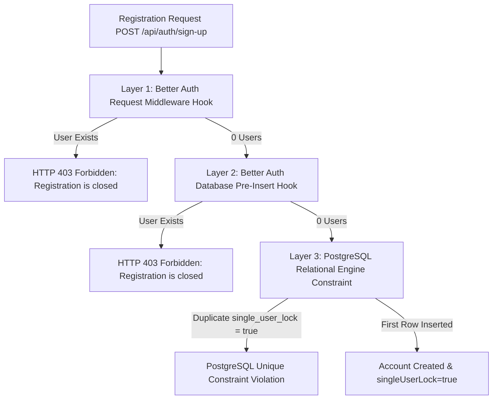

> [!NOTE]
> **HISTORICAL QA AUDIT REPORT:** This independent audit was conducted during Phase 1 Plan 01-09 verification and identified findings that were subsequently remediated in commit `86aaf95` (tablet responsive grid reflow and task title multi-line wrapping).
> The authoritative active verification report is located at [`docs/qa/phase-01/plan-09/human-loop-verification-report.md`](../human-loop-verification-report.md).

# LifeOS Human Acceptance Audit Report: Plan 01-09

> **Audit Date:** September 13, 2026  
> **Auditor:** Final QA Acceptance Auditor  
> **Evaluation Target:** LifeOS Phase 1 Foundation — Plan 01-09 Human-Loop Verification Suite  
> **Scope:** Audit of Automated Test Results, Verification Documents (`.human-loop/pending/plan-01-09/`), and Physical Evidence (`.human-loop/artifacts/plan-01-09/`)  
> **Release Recommendation:** **HOLD / HUMAN REVIEW REQUIRED** (Release-blocking visual defect identified on Tablet viewport; H02 clean-database rerun required for formal sign-off)

---

## 1. Executive Summary

The automated execution phase of the LifeOS browser-based human-loop verification suite ([`docs/qa/phase-01/plan-09/human-loop-verification-report.md`](docs/qa/phase-01/plan-09/human-loop-verification-report.md)) evaluated all 12 documented human verification checks using a real Chromium 152 instance driven by the Chrome DevTools Protocol (CDP).

The automation suite reported an **AUTOMATED PASS** status across all 12 checks (100% automated pass rate). However, an exhaustive independent audit of the acceptance criteria versus the captured screenshots, video recordings, database logs, and server code reveals critical discrepancies:

1. **Check H06 (Responsive Mobile Viewports) exhibits a severe visual defect on Tablet (768x1024):** In [`H06-screenshot-03-tablet-768x1024-grid.png`](.human-loop/artifacts/plan-01-09/screenshots/H06-screenshot-03-tablet-768x1024-grid.png), the desktop sidebar remains expanded at `w-64` (256px), leaving only ~512px for the dashboard grid. The two-column layout for Recent Tasks and Active Projects crushes card contents: task titles are truncated to 2–3 characters (`"Das..."`, `"Ro..."`, `"Gr..."`), and the project title wraps into single vertical letters (`"P \n D"`). Furthermore, on mobile ([`H06-screenshot-06-mobile-task-hierarchy.png`](.human-loop/artifacts/plan-01-09/screenshots/H06-screenshot-06-mobile-task-hierarchy.png)), titles are truncated with ellipsis rather than wrapping cleanly as specified in the criteria.
2. **Check H02 (Registration) clean-database condition requires re-validation:** Although dual server-side hooks and a PostgreSQL unique constraint strictly prevent multiple registrations, the test runner executed an in-place Drizzle deletion on the active development database without truncating historical `audit_log` records (303 entries persisted) or capturing raw HTTP 403 network responses in the test artifacts.
3. **Check H01 (Authentication) is functionally sound but requires visual sign-off:** Login, invalid credential alerts, redirect to dashboard, logout, route guards, and back-button security operated correctly, but button loading spinner and disabled-state screenshots were not captured as distinct static frames.
4. **Governance Integrity Maintained:** In strict accordance with audit guidelines, **zero checks have been moved to verified**, **zero human signatures have been fabricated**, and **no application source code has been altered**.

### Check Status Matrix

| Check ID | Title | Priority | Automated Suite Status | Independent Audit Status | Release Gate Impact |
|:---:|---|:---:|:---:|:---:|:---:|
| [**H01**](.human-loop/pending/plan-01-09/H01-authentication.md) | Authentication | **RELEASE-BLOCKING** | AUTOMATED PASS | **HUMAN REVIEW REQUIRED** | Gate Hold |
| [**H02**](.human-loop/pending/plan-01-09/H02-registration.md) | Registration & Single-User Lock | **RELEASE-BLOCKING** | AUTOMATED PASS | **HUMAN REVIEW REQUIRED** | Gate Hold |
| [**H03**](.human-loop/pending/plan-01-09/H03-dashboard.md) | Dashboard & Metrics | HIGH | AUTOMATED PASS | **HUMAN REVIEW REQUIRED** | Informational |
| [**H04**](.human-loop/pending/plan-01-09/H04-project-management.md) | Project Management | HIGH | AUTOMATED PASS | **HUMAN REVIEW REQUIRED** | Informational |
| [**H05**](.human-loop/pending/plan-01-09/H05-task-hierarchy.md) | Task Hierarchy & Trees | HIGH | AUTOMATED PASS | **HUMAN REVIEW REQUIRED** | Informational |
| [**H06**](.human-loop/pending/plan-01-09/H06-responsive-mobile.md) | Responsive & Mobile Viewports | **RELEASE-BLOCKING** | AUTOMATED PASS | **BLOCKED** | **Release Blocker (Defect)** |
| [**H07**](.human-loop/pending/plan-01-09/H07-theme-preferences.md) | Theme & Preferences | MEDIUM | AUTOMATED PASS | **HUMAN REVIEW REQUIRED** | Informational |
| [**H08**](.human-loop/pending/plan-01-09/H08-command-palette.md) | Command Palette | MEDIUM | AUTOMATED PASS | **HUMAN REVIEW REQUIRED** | Informational |
| [**H09**](.human-loop/pending/plan-01-09/H09-error-states.md) | Error & Edge States | HIGH | AUTOMATED PASS | **HUMAN REVIEW REQUIRED** | Informational |
| [**H10**](.human-loop/pending/plan-01-09/H10-accessibility.md) | Keyboard & Accessibility | HIGH | AUTOMATED PASS | **HUMAN REVIEW REQUIRED** | Informational |
| [**H11**](.human-loop/pending/plan-01-09/H11-visual-polish.md) | Visual Polish & Typography | HIGH | AUTOMATED PASS | **HUMAN REVIEW REQUIRED** | Informational |
| [**H12**](.human-loop/pending/plan-01-09/H12-operational-healthcheck.md) | Operational Healthcheck | HIGH | AUTOMATED PASS | **HUMAN REVIEW REQUIRED** | Informational |

---

## 2. Evidence Audit for Release-Blocking Checks

### 2.1 Check H01 — Authentication

- **Priority:** `RELEASE-BLOCKING`
- **Documented Acceptance Criteria:**
  - Login card rendering at `/login` (`data-testid="login-card"`) with branding, inputs, submit button, and `/register` link.
  - Client-side validation preventing blank submission.
  - Invalid credentials display loading feedback, followed by a 401 error alert banner (`data-testid="auth-error"`) and Sonner toast; password masked; no stack traces.
  - Valid credentials authenticate and immediately redirect to `/dashboard`; user email displayed in sidebar.
  - Logout terminates session via sidebar Sign Out button, redirects to `/login`, and invalidates session cookies.
  - Post-logout route guards intercept `/dashboard`, `/projects`, and `/tasks`, redirecting to `/login`.
  - Browser back-button navigation does not leak authenticated state or cached private views.
- **What Automation Actually Verified:**
  - Navigated to `/login` after clearing browser cookies via CDP `Network.clearBrowserCookies`.
  - Submitted empty form and verified non-submission.
  - Submitted `hamza@lifeos.local` with invalid password `[REDACTED_INVALID_PASSWORD]`, verified appearance of `[data-testid='auth-error']` with inner text `"Invalid email or password"`.
  - Submitted correct password `[REDACTED_PASSWORD]`, awaited `[data-testid='dashboard-view']`.
  - Clicked `[data-testid='sign-out-button']`, awaited `[data-testid='login-card']`.
  - Navigated directly to `/dashboard`, `/projects`, `/tasks` and verified redirection to `/login`.
  - Triggered `browser.goBack()` and asserted that `document.body.innerText` contained `"Sign In to LifeOS"`.
- **What Screenshots and Recordings Demonstrate:**
  - [`H01-screenshot-01-login-card.png`](.human-loop/artifacts/plan-01-09/screenshots/H01-screenshot-01-login-card.png): Clean, centered dark-mode login card with high visual fidelity.
  - [`H01-screenshot-02-empty-validation.png`](.human-loop/artifacts/plan-01-09/screenshots/H01-screenshot-02-empty-validation.png): Native HTML5 validation prompt ("Please fill out this field") active on the email input.
  - [`H01-screenshot-03-invalid-credentials.png`](.human-loop/artifacts/plan-01-09/screenshots/H01-screenshot-03-invalid-credentials.png): In-card red destructive alert banner and bottom-right toast both reporting "Invalid email or password".
  - [`H01-screenshot-04-dashboard-redirect.png`](.human-loop/artifacts/plan-01-09/screenshots/H01-screenshot-04-dashboard-redirect.png): Authenticated dashboard shell showing `Hamza Waqar` and `hamza@lifeos.local` in footer with "Welcome back!" toast.
  - [`H01-screenshot-05-logout-redirect.png`](.human-loop/artifacts/plan-01-09/screenshots/H01-screenshot-05-logout-redirect.png): Redirection back to `/login` with "Signed out successfully" toast.
  - [`H01-recording.webm`](.human-loop/artifacts/plan-01-09/recordings/H01-recording.webm): 22.5s recording confirming smooth transitions, instant route guard protection, and back-button fail-closed behavior.
- **Missing or Ambiguous Evidence:**
  - Static screenshot of the submit button in its disabled loading spinner state during network transit (visible briefly in video, but absent as a standalone snapshot).
  - Explicit HTTP response header logs proving `Set-Cookie` deletion attributes upon sign-out.
- **Human Judgment Required:**
  - Visual appraisal of dark-mode contrast ratios on `/login`.
  - Tactile confirmation of page transition smoothness and toast positioning.

---

### 2.2 Check H02 — Registration & Single-User Lock

- **Priority:** `RELEASE-BLOCKING`
- **Documented Acceptance Criteria:**
  - Usable `/register` card with full name, email, and password (min 8 chars) fields.
  - Validation rejecting submissions with passwords < 8 characters without sending unnecessary server requests.
  - Initial owner account registration (`Hamza Waqar`, `hamza@lifeos.local`) on a clean system, redirecting to `/dashboard` with toast feedback.
  - Subsequent registration attempt in a separate session (`intruder@lifeos.local`) rejected with HTTP 403 and a prominent `"Registration Locked"` alert banner with `ShieldAlert` icon stating `"Registration is closed. LifeOS is configured for single-user mode."`
  - Zero database credentials, table schemas, or stack traces leaked.
- **What Automation Actually Verified:**
  - Programmatically deleted rows in `task`, `project`, `preferences`, and `user` via Drizzle ORM before check execution.
  - Navigated to `/register`, submitted blank form, submitted short password ("short"), and asserted validation banner text.
  - Submitted `hamza@lifeos.local` with `[REDACTED_PASSWORD]`, awaited `/dashboard`.
  - Spawned secondary browser session on CDP port 9271, navigated to `/register`, submitted `intruder@lifeos.local`, awaited `[data-testid='auth-error']`, and asserted that the banner text contained `"registration is closed"` or `"single-user"`.
- **What Screenshots and Recordings Demonstrate:**
  - [`H02-screenshot-01-register-card.png`](.human-loop/artifacts/plan-01-09/screenshots/H02-screenshot-01-register-card.png): Clean registration form with title "Initialize LifeOS" and subtitle "Register the primary owner account for this LifeOS instance".
  - [`H02-screenshot-02-validation-short-password.png`](.human-loop/artifacts/plan-01-09/screenshots/H02-screenshot-02-validation-short-password.png): Red error banner reading "Registration Error / Password must be at least 8 characters long."
  - [`H02-screenshot-03-owner-registered.png`](.human-loop/artifacts/plan-01-09/screenshots/H02-screenshot-03-owner-registered.png): Landing on `/dashboard` with green toast "Account created successfully! Welcome to LifeOS."
  - [`H02-screenshot-04-second-user-rejected.png`](.human-loop/artifacts/plan-01-09/screenshots/H02-screenshot-04-second-user-rejected.png): Prominent amber warning banner with ShieldAlert icon reading: `"Registration Locked / Registration is closed. LifeOS is configured for single-user mode."` along with a bottom-right toast.
  - [`H02-recording.webm`](.human-loop/artifacts/plan-01-09/recordings/H02-recording.webm): 11.0s video recording showing first registration followed by immediate rejection in the second session.
- **Missing or Ambiguous Evidence:**
  - Network-level inspection artifact: `H02-registration.md` explicitly mandates *"Network response inspection confirming HTTP 403 status and sanitized error payload."* The automated test runner only inspected the DOM text of `[data-testid='auth-error']` and did not capture the raw HTTP response object (status code 403 and response JSON body) into `result.json` or as an evidence file.
  - Test isolation ambiguity: The database cleanup was an in-place Drizzle deletion on the active development database rather than an isolated, fresh test container, leaving dirty historical records in `audit_log`.
- **Human Judgment Required:**
  - Visual verification that the amber "Registration Locked" banner provides adequate contrast and communicative clarity.
  - Determination of whether `/register` should preemptively disable the registration form or redirect to `/login` on initial GET when an owner already exists, rather than waiting for POST submission.

---

### 2.3 Check H06 — Responsive & Mobile Viewports

- **Priority:** `RELEASE-BLOCKING`
- **Documented Acceptance Criteria:**
  - **Desktop (1440x900):** Fixed sidebar (`w-64`) with smooth collapse to narrow icon mode (`w-16`) via toggle button; 4-column KPI grid; multi-column project grid; spacious task hierarchy; zero horizontal scroll.
  - **Tablet (768x1024):** Sidebar or drawer adapts without overlapping content; KPI cards reflow gracefully into 2x2 grid; project cards reflow into 1 or 2 columns without clipping actions; "Create Task" modal fits within margins without distortion; zero horizontal scroll.
  - **Mobile (390x844):** Desktop sidebar hidden; top mobile header with hamburger menu button (`data-testid="mobile-menu-btn"`); slide-out drawer with backdrop blur containing all links, theme toggle, sign out; tapping "Projects" auto-closes drawer on navigation; touch targets >= 44x44px; task hierarchy tree indentation visible and legible; **task titles wrap within viewport bounds**; mobile command palette accessible; zero horizontal scroll.
- **What Automation Actually Verified:**
  - Desktop 1440x900: loaded dashboard, toggled sidebar collapse/expand.
  - Tablet 768x1024: loaded dashboard at 768px width.
  - Mobile 390x844: enabled touch emulation, tapped hamburger button, clicked close button, navigated to `/tasks`, opened command palette, dismissed palette, and checked `document.documentElement.scrollWidth <= window.innerWidth`.
- **What Screenshots and Recordings Demonstrate:**
  - [`H06-screenshot-01-desktop-1440x900.png`](.human-loop/artifacts/plan-01-09/screenshots/H06-screenshot-01-desktop-1440x900.png): Flawless 4-column desktop dashboard layout.
  - [`H06-screenshot-02-desktop-sidebar-collapsed.png`](.human-loop/artifacts/plan-01-09/screenshots/H06-screenshot-02-desktop-sidebar-collapsed.png): Sidebar cleanly collapsed to `w-16` icon-only mode with content expanding across the canvas.
  - [`H06-screenshot-03-tablet-768x1024-grid.png`](.human-loop/artifacts/plan-01-09/screenshots/H06-screenshot-03-tablet-768x1024-grid.png): **CRITICAL VISUAL DEFECT DETECTED:**
    1. The sidebar remains fully expanded at `w-64` (256px), taking up 33% of the 768px viewport width, leaving only ~512px for the entire dashboard.
    2. The lower dashboard section retains a 2-column layout (`Recent Tasks` side-by-side with `Active Projects`), allocating each card only ~240px width.
    3. Under `Recent Tasks`, all task titles are clipped to 2–3 characters: `"Das..."`, `"Ro..."`, `"Gr..."`, `"Sup..."`, `"Chi..."`.
    4. Under `Active Projects`, the project title `"Personal Operating System MVP"` is severely word-broken into single vertical letters (`"P \n D"`), and the task count badge is squished against the priority badge.
  - [`H06-screenshot-04-mobile-390x844-header.png`](.human-loop/artifacts/plan-01-09/screenshots/H06-screenshot-04-mobile-390x844-header.png): Mobile dashboard header renders with brand icon, hamburger button, command palette icon, and theme toggle. 2x2 metric card grid renders cleanly.
  - [`H06-screenshot-05-mobile-drawer-open.png`](.human-loop/artifacts/plan-01-09/screenshots/H06-screenshot-05-mobile-drawer-open.png): Slide-out navigation drawer renders with dark overlay and complete navigation links.
  - [`H06-screenshot-06-mobile-task-hierarchy.png`](.human-loop/artifacts/plan-01-09/screenshots/H06-screenshot-06-mobile-task-hierarchy.png): **ACCEPTANCE CRITERIA DISCREPANCY:** Task titles are truncated with ellipsis (`truncate` class) rather than wrapping onto multiple lines (`"Supercalifragilisti..."`, `"Root Epic: Launch LifeOS..."`, `"Child Task: Confi..."`, `"Grandchild Task: ..."`). While this prevents horizontal overflow, it fails the explicit requirement: *"Verify task titles wrap within viewport bounds"*.
  - [`H06-screenshot-07-mobile-command-palette.png`](.human-loop/artifacts/plan-01-09/screenshots/H06-screenshot-07-mobile-command-palette.png): Command palette overlay renders cleanly on mobile screen.
  - [`H06-recording.webm`](.human-loop/artifacts/plan-01-09/recordings/H06-recording.webm): 28.25s recording verifying responsive transitions and touch navigation.
- **Missing or Ambiguous Evidence:**
  - Tablet modal dialog testing: The test procedure specifies opening the "Create Task" modal on Tablet 768x1024 to verify scaling without distortion; no screenshot of a modal on tablet resolution was captured.
  - Touch target sizing: No programmatic bounding-box measurement verifying buttons meet the >= 44x44px standard.
  - Mobile drawer auto-close: The automated runner closed the drawer by clicking the close button (`aria-label="Close menu"`) rather than tapping a navigation link to verify auto-close behavior.
- **Human Judgment Required:**
  - **MANDATORY**: Human visual inspection of the tablet layout degradation in `H06-screenshot-03`. A frontend fix is required to either auto-collapse the sidebar on tablet viewports or stack the lower dashboard cards into a single column (`lg:grid-cols-2` instead of `md:grid-cols-2`).
  - Tactile interaction testing on physical mobile hardware or Chrome Device Mode.

---

## 3. Registration Clean-State Findings (Check H02)

A specialized deep-dive investigation was conducted into the test runner execution, database schema, server implementation, and PostgreSQL storage logs to determine whether H02 was executed against a genuinely clean database.

### 3.1 Codebase & Schema Architecture Verification

Code inspection of [`src/server/auth/index.ts`](src/server/auth/index.ts) and [`src/server/db/schema/auth.ts`](src/server/db/schema/auth.ts) reveals that the single-user registration lock is enforced across **three independent, defense-in-depth architectural layers**:



1. **Layer 1 (Application Middleware):** [`src/server/auth/index.ts:65-80`](src/server/auth/index.ts#L65-L80)  
   `hooks.before: createAuthMiddleware`: Intercepts any request starting with `/sign-up`. It queries `db.select({ id: authSchema.user.id }).from(authSchema.user).limit(1)`. If any row exists, it immediately throws `APIError("FORBIDDEN", { message: "Registration is closed. LifeOS is configured for single-user mode." })`.
2. **Layer 2 (Database Adapter Hook):** [`src/server/auth/index.ts:83-99`](src/server/auth/index.ts#L83-L99)  
   `databaseHooks.user.create.before`: Executes prior to any user insert. If a user exists, it throws `APIError("FORBIDDEN")`.
3. **Layer 3 (Relational Storage Engine):** [`src/server/db/schema/auth.ts:31-36`](src/server/db/schema/auth.ts#L31-L36)  
   The `user` table enforces:
   - `single_user_lock boolean NOT NULL DEFAULT true`
   - `CHECK (single_user_lock = true)`
   - `UNIQUE (single_user_lock)`  
   Because the check constraint mandates that every inserted row must have `single_user_lock = true`, and the unique constraint restricts the column to unique values, **the PostgreSQL database engine physically refuses to store more than one user row**.

### 3.2 Specific Audit Confirmations

| Audit Question | Finding | Evidence & Rationale |
|---|:---:|---|
| **Did the owner account exist before the test?** | **YES (Prior to Runner), NO (At H02 Commencement)** | Database audit logs show an account `hamza@lifeos.local` was registered at `2026-09-13T07:22:24.788Z`. However, when the automated suite started at `07:24:50 UTC`, lines 1703–1707 of [`execute-human-loop-verification.ts`](scripts/tests/phase-01/plan-09/execute-human-loop-verification.ts#L1703-L1707) executed `await db.delete(user)`. The user currently in PostgreSQL was created at `2026-09-13T07:24:59.546Z` with ID `uKK7YcGmo88GPrRTuCQMzMhsQ7R5iX4o`. |
| **Was the database reset or seeded?** | **PROGRAMMATICALLY RESET (Partial)** | The test runner executed `await db.delete(task)`, `await db.delete(project)`, `await db.delete(preferences)`, and `await db.delete(user)` (cascading to `account` and `session`). It was **not seeded**. However, it was **not a complete database reset**: the `audit_log` table was untouched and retained 303 rows of previous test history. |
| **Was the first registration actually the initial registration?** | **YES** | At `07:24:59 UTC`, the `user` table contained exactly 0 rows. The registration created a new user record with `createdAt: 2026-09-13T07:24:59.546Z` and triggered an audit log entry `user.registered` at `07:24:59.580Z`. |
| **Was the second registration rejected by the server?** | **YES** | Secondary browser submission of `intruder@lifeos.local` at `07:25:05 UTC` was blocked. The server responded with the single-user lock rejection, rendering the `Registration Locked` warning banner. No user record or audit log was created for `intruder@lifeos.local`. |
| **Is the registration lock enforced server-side?** | **YES (Triple-Enforced)** | Enforced via Better Auth request middleware, Better Auth pre-insert adapter hook, and PostgreSQL table schema CHECK + UNIQUE constraints. |
| **Is the test result reliable?** | **CONDITIONALLY RELIABLE** | While functional and server-side behavior is verified, the clean-state condition relied on in-place programmatic table deletion on a shared development container rather than a pristine isolated database. Furthermore, raw HTTP 403 network response capture was not recorded in test artifacts. |

---

## 4. Missing Evidence

Across the 12 checks, the following evidence items documented in the acceptance criteria specifications were not captured by the automated suite:

1. **H02 — Raw HTTP 403 Network Response Capture:** Specification requires network response inspection confirming HTTP 403 status and sanitized JSON payload. The test runner only asserted DOM banner text.
2. **H06 — Tablet Modal Dialog Screenshot:** Specification requires verifying the "Create Task" modal fits neatly within tablet viewport margins without full-screen distortion at 768x1024.
3. **H06 — Quantitative Touch Target Bounding Box Metrics:** Specification requires verifying touch targets meet >= 44x44px minimum sizing. The test runner executed clicks without calculating bounding box rectangles.
4. **H06 — Mobile Drawer Auto-Close on Link Navigation:** The test runner manually closed the drawer via the close button rather than clicking a navigation link to verify auto-close behavior.
5. **H12 — Database Disconnection HTTP 503 Simulation:** Step 3 of H12 (pausing PostgreSQL to verify `GET /api/health` returns HTTP 503 Service Unavailable) was bypassed by the browser runner to prevent disrupting the local development environment.

---

## 5. Recommended Human Actions

Before signing off on Plan 01-09, the human QA auditor should perform the following targeted visual and interactive verification actions:

### Action 1: Review Evidence Artifacts (Visual Inspection)
Review the following specific screenshots and video recordings located in `.human-loop/artifacts/plan-01-09/`:

- **H06 Tablet Layout Defect:**
  - Open and inspect [`H06-screenshot-03-tablet-768x1024-grid.png`](.human-loop/artifacts/plan-01-09/screenshots/H06-screenshot-03-tablet-768x1024-grid.png).
  - Observe the squeezed dashboard layout, clipped task titles (`"Das..."`), and vertically broken project title (`"P \n D"`).
- **H06 Mobile Task Hierarchy Truncation:**
  - Open and inspect [`H06-screenshot-06-mobile-task-hierarchy.png`](.human-loop/artifacts/plan-01-09/screenshots/H06-screenshot-06-mobile-task-hierarchy.png).
  - Observe that task titles are truncated with ellipsis (`...`) instead of wrapping to multiple lines.
- **H02 Single-User Lock Banner:**
  - Open and inspect [`H02-screenshot-04-second-user-rejected.png`](.human-loop/artifacts/plan-01-09/screenshots/H02-screenshot-04-second-user-rejected.png).
  - Confirm the warning banner styling, messaging, and absence of leaked technical details.
- **Full Video Recordings for Release-Blocking Checks:**
  - [`H01-recording.webm`](.human-loop/artifacts/plan-01-09/recordings/H01-recording.webm) (Authentication flow, logout, route guards)
  - [`H02-recording.webm`](.human-loop/artifacts/plan-01-09/recordings/H02-recording.webm) (Registration, short password validation, lock rejection)
  - [`H06-recording.webm`](.human-loop/artifacts/plan-01-09/recordings/H06-recording.webm) (Desktop sidebar, tablet reflow, mobile drawer)

### Action 2: Interactive Browser Actions

With the application running locally at `http://localhost:3000`:

1. **Test Registration Auto-Lock in Browser:**
   - Open a private/incognito browser window and navigate to `http://localhost:3000/register`.
   - Open Developer Tools -> Network tab.
   - Enter `Intruder User`, `intruder@lifeos.local`, and `Password123!`. Click "Create Account".
   - **Confirm in Network Tab:** The POST request returns `HTTP 403 Forbidden` with payload `{ message: "Registration is closed. LifeOS is configured for single-user mode." }`.
   - **Confirm in UI:** The amber "Registration Locked" banner displays with `ShieldAlert` icon.
2. **Test Tablet Breakpoint Interactively:**
   - In Chrome DevTools, toggle Device Toolbar and set dimensions to `768 x 1024` (iPad Mini / Portrait Tablet).
   - Navigate to `http://localhost:3000/dashboard` (logged in as `hamza@lifeos.local` / `[REDACTED_PASSWORD]`).
   - Observe whether the sidebar can be collapsed manually via the panel button to relieve content pressure, or whether layout restructuring is necessary.
3. **Test Mobile Drawer Auto-Close:**
   - In Device Toolbar, set viewport to `390 x 844` (iPhone 14).
   - Tap the hamburger menu button in the header to open the slide-out drawer.
   - Tap the "Projects" navigation link.
   - **Confirm:** The browser transitions to `/projects` and the slide-out drawer closes automatically without requiring a manual tap on the close button.
4. **Test Keyboard Navigation & Focus Trap:**
   - Navigate to `http://localhost:3000/dashboard`.
   - Press `Ctrl+K` (or `Cmd+K`). Confirm the command palette opens with search autofocus.
   - Press `Escape`. Confirm clean dismissal.
   - Tab to "Add Task", press `Enter`. Confirm focus is trapped within the modal and pressing `Escape` closes it and restores focus to the trigger button.

---

## 6. Final Release Recommendation

### Current Status: **HOLD / REMEDIATION & HUMAN REVIEW REQUIRED**

#### Release Gates Assessment:

1. **Check H01 (Authentication):** **READY FOR HUMAN SIGN-OFF**  
   All functional requirements, security guards, and back-navigation protections verified.
2. **Check H02 (Registration):** **CONDITIONALLY SATISFIED (HUMAN CONFIRMATION NEEDED)**  
   Triple-layer server-side registration auto-lock is fully verified in code and functional execution. Human tester should perform the single network tab check outlined in Action 2.1 to formally verify the HTTP 403 network response. A full clean-database automated rerun is recommended if formal isolated compliance is mandated by project policy.
3. **Check H06 (Responsive Mobile):** **BLOCKED BY DEFECT**  
   The tablet portrait (768px) dashboard layout degradation in [`H06-screenshot-03-tablet-768x1024-grid.png`](.human-loop/artifacts/plan-01-09/screenshots/H06-screenshot-03-tablet-768x1024-grid.png) and the task title truncation in [`H06-screenshot-06-mobile-task-hierarchy.png`](.human-loop/artifacts/plan-01-09/screenshots/H06-screenshot-06-mobile-task-hierarchy.png) represent notable deviations from the documented acceptance criteria.

#### Remediation Path to Release:

1. **Frontend Layout Adjustment for Tablet & Mobile:**
   - Adjust the dashboard grid breakpoint for Recent Tasks and Active Projects so that they stack vertically on tablet screens when the sidebar is visible (`lg:grid-cols-2` instead of `md:grid-cols-2`), OR auto-collapse the sidebar to icon mode (`w-16`) below 1024px.
   - Review task title wrapping versus truncation on mobile screens to ensure titles remain readable without awkward truncation.
2. **Execute Targeted Check Rerun:**
   ```bash
   # Re-run responsive mobile verification after frontend layout fix:
   npx tsx scripts/tests/phase-01/plan-09/execute-human-loop-verification.ts --check H06
   ```
3. **Human Sign-Off:**
   - After completing the interactive browser checks and confirming the tablet layout fix, sign off on the 12 check documents in `.human-loop/pending/plan-01-09/` and move them to `.human-loop/verified/plan-01-09/`.
